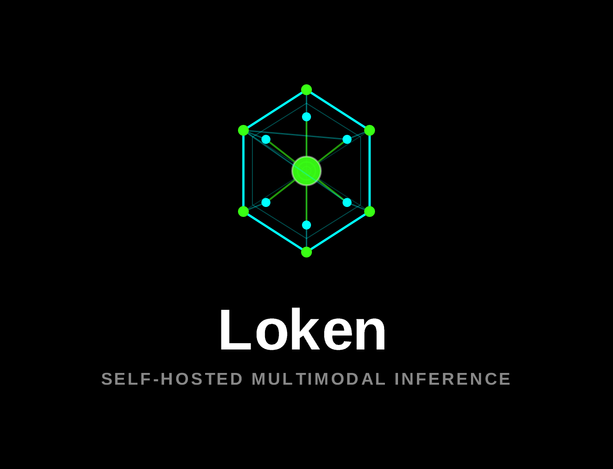

<!--
  ORG PROFILE — rendered at https://github.com/loken-ai
  Branding: the token chain (white circles, emerald top circle) on the indigo tile. Full brand
  kit + source SVGs live in this repo under brand/. The top circle is a logo device; in text
  write "LOKEN".
-->

  

  A full-Rust inference stack that runs large language <em>and</em> generative-media models
  entirely on your own machine.

---

## What is LOKEN?

**LOKEN** — from **Lo**cal + tok**en** — is a local-first, multimodal AI stack written from
the ground up in Rust. No Python at runtime, no framework underneath.

One server speaks the **OpenAI- and Ollama-compatible** APIs across every modality:

- **Text** — chat/completions, embeddings, reranking
- **Vision** — image understanding
- **Speech** — text-to-speech and transcription
- **Generative media** — image, audio/music, video, symbolic MIDI

It is **private**: it runs on your hardware and calls nothing out.

It is **measured**: every performance claim comes from a run against llama.cpp, Ollama or vLLM
— same prompts, same clock — and the cells where LOKEN loses are published with the rest.

## Why it exists

It began as an experiment. A way to learn how modern AI actually runs — transformers, LLMs,
inference — by implementing it rather than reading about it, and to learn Rust properly along
the way.

It kept going because the questions turned out to be worth chasing.

- **Learning by building it.** Attention, KV cache, quantisation, paged decode, sampling,
  continuous batching, then diffusion and audio models. Papers explain the shape; writing each
  one yourself is what exposes what the explanation left out.
- **Full Rust, all the way down.** The tensor substrate, the kernels and the model
  implementations are the project. The constraint *is* the point: it forces each layer to be
  understood rather than imported.
- **Speed as a discipline, not a boast.** Chasing throughput is what turns vague design
  questions into concrete ones.
- **Joules count as much as tokens.** A local engine runs on hardware someone is paying for
  and sitting next to.
- **Nothing is too small to be worth it.** A 0.5B model on a laptop CPU is as much a target as
  a large one across several GPUs.

## How this was built

**Some of it was vibe coded** — written with an AI assistant in the loop, at a volume no
single pair of hands produces in the same time. Not all of it, and not the same way
everywhere: the further a piece is from something measurable, the less it was delegated.

Saying so matters, because it tells you what to check. What is never handed over is the
design and the numbers. Nothing here is claimed because a model sounded sure of it — a
kernel that is wrong is a wrong answer or a slower one, and both show up in a run.

### If you recognise your code

Where an implementation follows another project, that project is named. Each repository's
`NOTICE.md` lists every port, adaptation and derived kernel with its upstream and its licence.

Nothing was knowingly taken without credit. But this is a large surface built fast, and good
intentions are not a guarantee.

**If you recognise your work and it is not credited — or you would rather it were not here at
all — open an issue.** It will be attributed or removed, promptly and without argument.

And the other direction is open: if anything here is useful to the projects it learned from,
take it. No attribution needed. The cudarc patches already ship with their route upstream
written down.

## What is being tried

Some of it works. Some is half-built. Some will not survive contact with measurement.

- **Clustering** — spreading work across more than one machine, and deciding per request
  whether a second node earns the hop it costs. A single request never gets faster because a
  peer exists; what a peer buys is served requests per second.
- **Vulkan and ROCm** — CUDA and OpenCL are covered today, which leaves out a lot of the
  hardware people actually own.
- **Energy as a target, not a report** — joules per token is already measured. The open
  question is which placement decisions can be made *from* it rather than judged by it.

## Repositories

Being split out of a single working tree. Names without a link have not landed yet.

| Repo | What it is |
|------|------------|
| **loken** | The inference **server** — engine, tensor substrate, every modality |
| **verve** | A local-first terminal coding agent |
| **gui** | Desktop client for any Ollama/OpenAI-compatible server *(name not settled)* |
| **assay** | Benchmarks one local inference server against another, and ships the protocol that makes the comparison fair |
| [**cudarc**](https://github.com/loken-ai/cudarc) | The local delta over [cudarc](https://github.com/chelsea0x3b/cudarc) — kept only until the patches are upstream |

## Status

🧪 **Experimental.** APIs and internals move fast.

Model *weights* are never distributed here — each model remains under its own license.

## Acknowledgements

None of this would exist without the projects that mapped the territory first.

| Project | What LOKEN owes it |
|---------|--------------------|
| [**ggml**](https://github.com/ggml-org/ggml) | The quantisation block formats it dequantises — the k-quants above all — and **GGUF**, the container it reads |
| [**llama.cpp**](https://github.com/ggml-org/llama.cpp) | Building those into an engine, and proving quantised local inference was practical |
| [**Ollama**](https://github.com/ollama/ollama) | The API and the model-management ergonomics it stays compatible with |
| [**vLLM**](https://github.com/vllm-project/vllm) | Continuous batching and paged attention — the ideas behind the concurrent decode path |
| [**candle**](https://github.com/huggingface/candle) | Being where this project started: a Rust tensor library with real CUDA support |

Three of them are also the yardstick.

### Why LOKEN no longer builds on candle

Not because anything is wrong with it. The two projects simply want different things.

candle is a general-purpose tensor library, and a general-purpose op is the right default —
right up until you start measuring yourself against vLLM.

The break came out of profiling rather than principle. Two examples, both in the sampler:

- **Batched greedy decode.** candle's `argmax`, plus the per-row host scan around it, cost
  roughly 2 ms per step at batch 8. That one generic op accounted for essentially the whole
  throughput gap against vLLM at that batch size.
- **The sampled path.** Per-row softmax, sort and multinomial, running on the device, once per
  row, per step.

Every one of those fixes meant owning the kernel outright. Past a certain number of them, the
generic layer underneath is no longer carrying anything.

So LOKEN runs on its own tensor substrate — and candle's source stays what it has always been
here: a reference worth reading.

## License

Dual-licensed **MIT OR Apache-2.0**, at your option. Third-party attributions are listed in
each repo's `NOTICE.md`.
